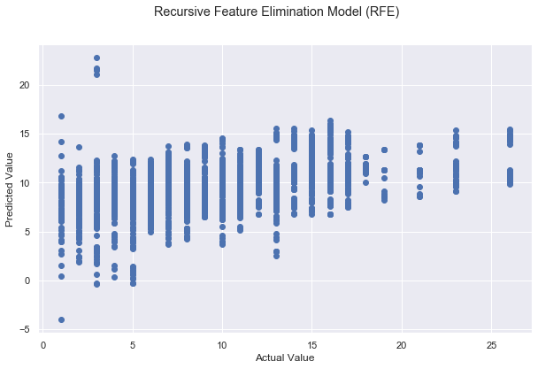
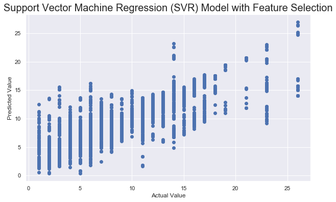

# Legal Studies 123 Final Project: #

## Predicting New York City Crime Rates with Factors of Gentrification ##

### Project Members: Abdul Choudhry, Sammy Chean-Udell, Christian Gutierrez, Louisa Ng ###
### Group 10, Spring 2022 ### 

#
# Introduction #
As gentrification continues to impact marginalized communities of color across the nation, individuals from low socioeconomic backgrounds are displaced from their areas of residence and forced to relocate elsewhere, causing crime rates to significantly change in the region where the displacement occurred. Therefore, it is very important to understand how and why gentrification may influence crime rates in regions where marginalized communities of color across the nation have been forced to leave. Our project focuses on the relationship between gentrification, specifically eviction and socioeconomic housing information, and crime rates across the five boroughs of New York. We initially hypothesized that gentrification would indicate crime would increase as a result of evictions increasing within the boroughs of New York; however, our research shows that an inverse correlation between evictions and crime rates exists, meaning that as the number of evictions increases, the number of crimes decreases. While on the surface a decrease in crime seems a net positive, in actuality, it leads to the centralization of crime in neighborhoods in which affected individuals are pushed. The centralization of crime brings an increase in racially biased policing practices, such as the use of risk assessment tools, which further perpetuates cycles of impoverishment in these communities. While crime rates may, in theory, decrease in the developing communities because of gentrification, crime rates are increasing in outskirt neighborhoods because of the influx of displaced individuals and police officers.

Our visualizations show that both Brooklyn and the Bronx have the highest number of evictions and a significantly low number of crimes. According to Schelling’s “Dynamic Models of Segregation”, this is most likely due to a phenomenon known as the “racial tipping point”, a concept where an area's non-white population will eventually reach a certain threshold such that white “flight” exists (Schelling 1971). So, as non-white resident leave the gentrified areas, a “poverty threshold” is reached, decreasing crime rates in these immediate communities.

Using data obtained from public-use sources made available by the State of New York, we delve into the relationship between evictions and crime rates in the state. Our datasets primarily come from the city of New York’s open access domain, which hosts myriad datasets across various industries. We use eviction as a marker for gentrification because it signifies the beginning of the gentrification process. Through exploratory data analysis and predictive modeling techniques such as Decision Tree Regression, we prove the existence of the inverse relationship between crime and eviction rates. After exploring OLS, Ridge, Lasso, SVR, and Decision Tree Regression methods, the Decision Tree model had the lowest RMSE score and highest R^2 score, signifying its success in predicting crime rates.


## Imported Data ## 
The following are the three datasets we used in our analysis:

`NYPD_arrests_sampled100000.csv` - In order to perform our initial exploratory data analysis, we sampled 100,000 rows of the larger New York City arrest dataset, which had about one million rows of data.

`Evictions.csv` - This dataset provides information about the eviction rates in New York City, with specific information about the eviction incident, latitude, longitude, and even name of the individual being evicted which is quite frankly unethical in the context of publicly available legal data.

`Housing_New_York_Units_by_Building.csv` - This dataset contains information about the state of the housing units in New York, including quantitative data such as the number of extremely low and moderately low income housing units and number of middle income units based on each housing development in the city. 

#
# Part 1: Exploratory Data Analysis (EDA) #

In order to perform our initial exploratory data analysis, we sampled 100,000 rows of the larger New York City arrest dataset, which had about one million rows of data and then dropped all the columns with NaN values. We saved this table into a DataFrame variable called  `arrests`. We will be working with the `arrests` table for the remainder of the project.


```python
null_columns = ["PD_CD", "PD_DESC", "KY_CD", "OFNS_DESC", "LAW_CODE", "LAW_CAT_CD", "X_COORD_CD", 
               "Y_COORD_CD", "Latitude", "Longitude", "Lon_Lat", "Point"]

arrests = arrests.dropna()

arrests
```


<div>
<style scoped>
    .dataframe tbody tr th:only-of-type {
        vertical-align: middle;
    }

    .dataframe tbody tr th {
        vertical-align: top;
    }

    .dataframe thead th {
        text-align: right;
    }
</style>
<table border="1" class="dataframe">
  <thead>
    <tr style="text-align: right;">
      <th></th>
      <th>ARREST_KEY</th>
      <th>ARREST_DATE</th>
      <th>PD_CD</th>
      <th>PD_DESC</th>
      <th>KY_CD</th>
      <th>OFNS_DESC</th>
      <th>LAW_CODE</th>
      <th>LAW_CAT_CD</th>
      <th>ARREST_BORO</th>
      <th>ARREST_PRECINCT</th>
      <th>JURISDICTION_CODE</th>
      <th>AGE_GROUP</th>
      <th>PERP_SEX</th>
      <th>PERP_RACE</th>
      <th>X_COORD_CD</th>
      <th>Y_COORD_CD</th>
      <th>Latitude</th>
      <th>Longitude</th>
      <th>Lon_Lat</th>
    </tr>
  </thead>
  <tbody>
    <tr>
      <th>0</th>
      <td>74040476</td>
      <td>08/07/2010</td>
      <td>905.0</td>
      <td>INTOXICATED DRIVING,ALCOHOL</td>
      <td>347.0</td>
      <td>INTOXICATED &amp; IMPAIRED DRIVING</td>
      <td>VTL11920M3</td>
      <td>M</td>
      <td>Q</td>
      <td>110</td>
      <td>0.0</td>
      <td>18-24</td>
      <td>M</td>
      <td>BLACK HISPANIC</td>
      <td>1019164.0</td>
      <td>210169.0</td>
      <td>40.743481</td>
      <td>-73.874004</td>
      <td>POINT (-73.87400353699996 40.743481264000025)</td>
    </tr>
    <tr>
      <th>1</th>
      <td>73484776</td>
      <td>07/01/2010</td>
      <td>478.0</td>
      <td>THEFT OF SERVICES, UNCLASSIFIED</td>
      <td>343.0</td>
      <td>OTHER OFFENSES RELATED TO THEFT</td>
      <td>PL 1651503</td>
      <td>M</td>
      <td>B</td>
      <td>52</td>
      <td>1.0</td>
      <td>&lt;18</td>
      <td>M</td>
      <td>BLACK</td>
      <td>1014295.0</td>
      <td>253237.0</td>
      <td>40.861709</td>
      <td>-73.891382</td>
      <td>POINT (-73.89138208599996 40.86170890900007)</td>
    </tr>
    <tr>
      <th>2</th>
      <td>90801077</td>
      <td>05/24/2013</td>
      <td>101.0</td>
      <td>ASSAULT 3</td>
      <td>344.0</td>
      <td>ASSAULT 3 &amp; RELATED OFFENSES</td>
      <td>PL 1200001</td>
      <td>M</td>
      <td>K</td>
      <td>77</td>
      <td>0.0</td>
      <td>25-44</td>
      <td>F</td>
      <td>BLACK</td>
      <td>1005328.0</td>
      <td>183150.0</td>
      <td>40.669364</td>
      <td>-73.924020</td>
      <td>POINT (-73.92401953899997 40.669364302000076)</td>
    </tr>
    <tr>
      <th>3</th>
      <td>90565435</td>
      <td>05/10/2013</td>
      <td>782.0</td>
      <td>WEAPONS, POSSESSION, ETC</td>
      <td>236.0</td>
      <td>DANGEROUS WEAPONS</td>
      <td>PL 2650101</td>
      <td>M</td>
      <td>S</td>
      <td>123</td>
      <td>0.0</td>
      <td>18-24</td>
      <td>M</td>
      <td>WHITE</td>
      <td>930862.0</td>
      <td>133331.0</td>
      <td>40.532486</td>
      <td>-74.192060</td>
      <td>POINT (-74.19206031 40.53248569700002)</td>
    </tr>
    <tr>
      <th>4</th>
      <td>23364940</td>
      <td>07/13/2006</td>
      <td>109.0</td>
      <td>ASSAULT 2,1,UNCLASSIFIED</td>
      <td>106.0</td>
      <td>FELONY ASSAULT</td>
      <td>PL 1201001</td>
      <td>F</td>
      <td>K</td>
      <td>81</td>
      <td>0.0</td>
      <td>18-24</td>
      <td>M</td>
      <td>BLACK</td>
      <td>1005312.0</td>
      <td>190540.0</td>
      <td>40.689648</td>
      <td>-73.924054</td>
      <td>POINT (-73.92405412199997 40.68964821100008)</td>
    </tr>
    <tr>
      <th>...</th>
      <td>...</td>
      <td>...</td>
      <td>...</td>
      <td>...</td>
      <td>...</td>
      <td>...</td>
      <td>...</td>
      <td>...</td>
      <td>...</td>
      <td>...</td>
      <td>...</td>
      <td>...</td>
      <td>...</td>
      <td>...</td>
      <td>...</td>
      <td>...</td>
      <td>...</td>
      <td>...</td>
      <td>...</td>
    </tr>
    <tr>
      <th>99995</th>
      <td>10554275</td>
      <td>03/03/2006</td>
      <td>849.0</td>
      <td>NY STATE LAWS,UNCLASSIFIED VIOLATION</td>
      <td>677.0</td>
      <td>OTHER STATE LAWS</td>
      <td>LOC000000V</td>
      <td>V</td>
      <td>K</td>
      <td>62</td>
      <td>1.0</td>
      <td>&lt;18</td>
      <td>F</td>
      <td>WHITE</td>
      <td>988289.0</td>
      <td>161509.0</td>
      <td>40.609989</td>
      <td>-73.985455</td>
      <td>POINT (-73.98545461799995 40.60998854600007)</td>
    </tr>
    <tr>
      <th>99996</th>
      <td>139566715</td>
      <td>11/08/2014</td>
      <td>922.0</td>
      <td>TRAFFIC,UNCLASSIFIED MISDEMEAN</td>
      <td>348.0</td>
      <td>VEHICLE AND TRAFFIC LAWS</td>
      <td>VTL0511001</td>
      <td>M</td>
      <td>B</td>
      <td>52</td>
      <td>0.0</td>
      <td>25-44</td>
      <td>M</td>
      <td>BLACK</td>
      <td>1008368.0</td>
      <td>253290.0</td>
      <td>40.861873</td>
      <td>-73.912809</td>
      <td>POINT (-73.91280930499997 40.86187255900006)</td>
    </tr>
    <tr>
      <th>99997</th>
      <td>190943683</td>
      <td>12/09/2018</td>
      <td>106.0</td>
      <td>ASSAULT 2,1,PEACE OFFICER</td>
      <td>106.0</td>
      <td>FELONY ASSAULT</td>
      <td>PL 1201100</td>
      <td>F</td>
      <td>M</td>
      <td>32</td>
      <td>0.0</td>
      <td>18-24</td>
      <td>M</td>
      <td>BLACK HISPANIC</td>
      <td>1000970.0</td>
      <td>239324.0</td>
      <td>40.823557</td>
      <td>-73.939590</td>
      <td>POINT (-73.93958959499997 40.82355708600005)</td>
    </tr>
    <tr>
      <th>99998</th>
      <td>69421414</td>
      <td>12/31/2009</td>
      <td>339.0</td>
      <td>LARCENY,PETIT FROM OPEN AREAS,UNCLASSIFIED</td>
      <td>341.0</td>
      <td>PETIT LARCENY</td>
      <td>PL 1552500</td>
      <td>M</td>
      <td>Q</td>
      <td>112</td>
      <td>0.0</td>
      <td>45-64</td>
      <td>M</td>
      <td>WHITE</td>
      <td>1025712.0</td>
      <td>198128.0</td>
      <td>40.710403</td>
      <td>-73.850447</td>
      <td>POINT (-73.85044729299993 40.710403418000055)</td>
    </tr>
    <tr>
      <th>99999</th>
      <td>81235561</td>
      <td>10/17/2011</td>
      <td>567.0</td>
      <td>MARIJUANA, POSSESSION 4 &amp; 5</td>
      <td>235.0</td>
      <td>DANGEROUS DRUGS</td>
      <td>PL 2211001</td>
      <td>M</td>
      <td>B</td>
      <td>52</td>
      <td>0.0</td>
      <td>25-44</td>
      <td>M</td>
      <td>BLACK HISPANIC</td>
      <td>1010668.0</td>
      <td>253614.0</td>
      <td>40.862755</td>
      <td>-73.904493</td>
      <td>POINT (-73.904493002 40.86275525800004)</td>
    </tr>
  </tbody>
</table>
<p>99512 rows × 19 columns</p>
</div>

The image below takes geoJSON data of New York City neighborhood outlines and plots them on the map. Each dataset that we are working wih include a Latitude and Longitude column. We are using a spatial join to merge our arrest and other datasets with the geoJSON data to map each datum of each table to their respective neighborhoods.


We save New York City evictions data into a variable called  `NY_eviction`  and select our desired features before removing NAN values to create the resulting  `NY_evictions_new` table. This dataset houses the features that help us determine how gentrified a neighborhood in New York is. We aim to analyze the relationship between crime (aka the arrests data that we took a sample of) and evictions in New York City, as the number of evictions in a neighborhood reveals how gentrified the area is.


```python
NY_evictions = pd.read_csv("Evictions.csv")
```


```python
#dropping null values
NY_evictions_new = NY_evictions[["Executed Date", "Residential/Commercial", "BOROUGH", 
                                "Eviction Postcode", "Eviction/Legal Possession", "Latitude", 
                                "Longitude", "Council District", "BIN", "BBL"]].dropna()
NY_evictions_new
```


<div>
<style scoped>
    .dataframe tbody tr th:only-of-type {
        vertical-align: middle;
    }

    .dataframe tbody tr th {
        vertical-align: top;
    }

    .dataframe thead th {
        text-align: right;
    }
</style>
<table border="1" class="dataframe">
  <thead>
    <tr style="text-align: right;">
      <th></th>
      <th>Executed Date</th>
      <th>Residential/Commercial</th>
      <th>BOROUGH</th>
      <th>Eviction Postcode</th>
      <th>Eviction/Legal Possession</th>
      <th>Latitude</th>
      <th>Longitude</th>
      <th>Council District</th>
      <th>BIN</th>
      <th>BBL</th>
    </tr>
  </thead>
  <tbody>
    <tr>
      <th>0</th>
      <td>08/16/2019</td>
      <td>Residential</td>
      <td>BROOKLYN</td>
      <td>11225</td>
      <td>Possession</td>
      <td>40.661502</td>
      <td>-73.951910</td>
      <td>40.0</td>
      <td>3035375.0</td>
      <td>3.013290e+09</td>
    </tr>
    <tr>
      <th>1</th>
      <td>04/16/2018</td>
      <td>Residential</td>
      <td>BROOKLYN</td>
      <td>11225</td>
      <td>Possession</td>
      <td>40.664977</td>
      <td>-73.959031</td>
      <td>35.0</td>
      <td>3388698.0</td>
      <td>3.013020e+09</td>
    </tr>
    <tr>
      <th>2</th>
      <td>10/17/2017</td>
      <td>Residential</td>
      <td>BROOKLYN</td>
      <td>11237</td>
      <td>Possession</td>
      <td>40.697203</td>
      <td>-73.918022</td>
      <td>37.0</td>
      <td>3075674.0</td>
      <td>3.033070e+09</td>
    </tr>
    <tr>
      <th>3</th>
      <td>06/27/2017</td>
      <td>Residential</td>
      <td>BRONX</td>
      <td>10455</td>
      <td>Possession</td>
      <td>40.816478</td>
      <td>-73.909699</td>
      <td>17.0</td>
      <td>2004460.0</td>
      <td>2.026240e+09</td>
    </tr>
    <tr>
      <th>4</th>
      <td>01/22/2019</td>
      <td>Residential</td>
      <td>QUEENS</td>
      <td>11414</td>
      <td>Possession</td>
      <td>40.668237</td>
      <td>-73.849362</td>
      <td>32.0</td>
      <td>4434842.0</td>
      <td>4.114310e+09</td>
    </tr>
    <tr>
      <th>...</th>
      <td>...</td>
      <td>...</td>
      <td>...</td>
      <td>...</td>
      <td>...</td>
      <td>...</td>
      <td>...</td>
      <td>...</td>
      <td>...</td>
      <td>...</td>
    </tr>
    <tr>
      <th>67722</th>
      <td>02/16/2018</td>
      <td>Residential</td>
      <td>QUEENS</td>
      <td>11373</td>
      <td>Possession</td>
      <td>40.742171</td>
      <td>-73.880699</td>
      <td>25.0</td>
      <td>4037523.0</td>
      <td>4.015180e+09</td>
    </tr>
    <tr>
      <th>67723</th>
      <td>03/10/2020</td>
      <td>Residential</td>
      <td>QUEENS</td>
      <td>11435</td>
      <td>Possession</td>
      <td>40.708943</td>
      <td>-73.814336</td>
      <td>24.0</td>
      <td>4440741.0</td>
      <td>4.097100e+09</td>
    </tr>
    <tr>
      <th>67724</th>
      <td>04/12/2018</td>
      <td>Residential</td>
      <td>MANHATTAN</td>
      <td>10001</td>
      <td>Possession</td>
      <td>40.746602</td>
      <td>-73.991829</td>
      <td>3.0</td>
      <td>1015100.0</td>
      <td>1.008040e+09</td>
    </tr>
    <tr>
      <th>67725</th>
      <td>02/14/2019</td>
      <td>Residential</td>
      <td>BRONX</td>
      <td>10474</td>
      <td>Possession</td>
      <td>40.815774</td>
      <td>-73.885852</td>
      <td>17.0</td>
      <td>2006567.0</td>
      <td>2.027630e+09</td>
    </tr>
    <tr>
      <th>67727</th>
      <td>11/08/2018</td>
      <td>Commercial</td>
      <td>BRONX</td>
      <td>10457</td>
      <td>Possession</td>
      <td>40.854706</td>
      <td>-73.899063</td>
      <td>15.0</td>
      <td>2013549.0</td>
      <td>2.031490e+09</td>
    </tr>
  </tbody>
</table>
<p>61166 rows × 10 columns</p>
</div>


Below is a visualization that compares the the number of evictions and the number of arrests between the five different boroughs in NYC in 2019. The year 2019 is an important year because it was the last year before COVID impacted our dataset. We can see that there were far more evictions (yellow) than arrests (black) in 2019 per borough; however, we can conclude that both the Brooklyn and Manhattan boroughs have the highest number of evictions and arrests in 2019.


The below plot shows the number of crimes committed over the last 14 years across all 5 boroughs. We can see that all five boroughs share the same downward trend as a function of time. We can also note that Staten Island has a significantly lower number of crimes compared to the rest of the boroughs, staying relatively consistent over the past 14 years, and we believe this is because of its low population size compared to other boroughs.


#
## Analyzing Arrests and Evictions by Race ##
\
In this part, we filtered the arrest data by `PERP_RACE` and `neighborhood` and took the count of each (PERP_RACE, neighborhood) pair in the `race_count` table, which is a table that details how many individuals of each race live in each neighborhood. The choropleth map has 6 layers (one for each race) and you can select and deselect these layers using LayerControl on the top right of the map. (Note: choropleth maps do not load in MarkDown, so below is an image for each layer on the choropleth map.


The layered choropleth map highlights the relationship between gentrification (specifically eviction) and crime in New York City. As we can see above, viewers are able to adjust the layered choropleth map by race, sorting neighborhoods in NYC by their number of arrests by race. Furthermore, we color-coded the map by a green gradient to detail how crime-filled a neighborhood is. If an area is a darker green, then it appears in our dataset more and indicates there is higher arrest rates for a certain race. Additionally, we plotted points over all layers of the choropleth map. The yellow dots on the map represent individual eviction incidents and our visualization shows that most evictions occur in the Bronx borough which validates the findings of our layered bar plot in previous cells. Lastly, each yellow dot is taken from a random sample of eviction coordinate pairs in order to prevent the choropleth map from overloading with too many data points.


According to the heatmap above, we are able to confirm our findings from the layered choropleth map. Most of the data (which consist of the eviction incidents) are clustered around the Bronx borough, which is illustrated by the "red" segment on the top of the heatmap.


The above plot shows viewers the number of evictions per borough in New York City while each borough is color-coded a specific color. Brooklyn is Black, Bronx is Red, Staten Island is Blue, Queens is Green, and Manhattan is Yellow. Additionally, each point on the folium map is taken from a random sample of coordinate pairs in order to prevent the map from overloading with too many data points.


This map shows the relationship between crime and gentrification (specifically eviction) in New York City. In our proposal, we hypothesized that eviction is one of the most prevalent factors of gentrification. This idea is showcased through the clustering of eviction (red points) and arrests (yellow points) by region (such as the Bronx). Because of the clustering, we can conclude that there exists a relationship between crime and evictions. Later on in our analysis, we will test various regression models in order to predict crime as a function of evictions.
#
# Part 2: Modeling & Prediction #


```python
evictions_count
```


<div>
<style scoped>
    .dataframe tbody tr th:only-of-type {
        vertical-align: middle;
    }

    .dataframe tbody tr th {
        vertical-align: top;
    }

    .dataframe thead th {
        text-align: right;
    }
</style>
<table border="1" class="dataframe">
  <thead>
    <tr style="text-align: right;">
      <th></th>
      <th>month</th>
      <th>year</th>
      <th>neighborhood</th>
      <th>Residential/Commercial</th>
      <th>eviction_count</th>
    </tr>
  </thead>
  <tbody>
    <tr>
      <th>0</th>
      <td>1</td>
      <td>2018</td>
      <td>Fordham</td>
      <td>Residential</td>
      <td>79</td>
    </tr>
    <tr>
      <th>1</th>
      <td>10</td>
      <td>2017</td>
      <td>Fordham</td>
      <td>Residential</td>
      <td>76</td>
    </tr>
    <tr>
      <th>2</th>
      <td>1</td>
      <td>2017</td>
      <td>East Flatbush</td>
      <td>Residential</td>
      <td>73</td>
    </tr>
    <tr>
      <th>3</th>
      <td>5</td>
      <td>2017</td>
      <td>Fordham</td>
      <td>Residential</td>
      <td>73</td>
    </tr>
    <tr>
      <th>4</th>
      <td>1</td>
      <td>2017</td>
      <td>Fordham</td>
      <td>Residential</td>
      <td>72</td>
    </tr>
    <tr>
      <th>...</th>
      <td>...</td>
      <td>...</td>
      <td>...</td>
      <td>...</td>
      <td>...</td>
    </tr>
    <tr>
      <th>8962</th>
      <td>4</td>
      <td>2018</td>
      <td>Floral Park</td>
      <td>Commercial</td>
      <td>1</td>
    </tr>
    <tr>
      <th>8963</th>
      <td>4</td>
      <td>2018</td>
      <td>Flatlands</td>
      <td>Commercial</td>
      <td>1</td>
    </tr>
    <tr>
      <th>8964</th>
      <td>4</td>
      <td>2018</td>
      <td>Emerson Hill</td>
      <td>Residential</td>
      <td>1</td>
    </tr>
    <tr>
      <th>8965</th>
      <td>9</td>
      <td>2018</td>
      <td>Park Slope</td>
      <td>Residential</td>
      <td>1</td>
    </tr>
    <tr>
      <th>8966</th>
      <td>1</td>
      <td>2017</td>
      <td>Allerton</td>
      <td>Commercial</td>
      <td>1</td>
    </tr>
  </tbody>
</table>
<p>8967 rows × 5 columns</p>
</div>


```python
ny_housing_counts
```


<div>
<style scoped>
    .dataframe tbody tr th:only-of-type {
        vertical-align: middle;
    }

    .dataframe tbody tr th {
        vertical-align: top;
    }

    .dataframe thead th {
        text-align: right;
    }
</style>
<table border="1" class="dataframe">
  <thead>
    <tr style="text-align: right;">
      <th></th>
      <th>month</th>
      <th>year</th>
      <th>neighborhood</th>
      <th>Extremely Low Income Units</th>
      <th>Very Low Income Units</th>
      <th>Low Income Units</th>
      <th>Moderate Income Units</th>
      <th>Middle Income Units</th>
      <th>Other Income Units</th>
      <th>Studio Units</th>
      <th>1-BR Units</th>
      <th>2-BR Units</th>
      <th>3-BR Units</th>
      <th>4-BR Units</th>
      <th>5-BR Units</th>
      <th>6-BR+ Units</th>
      <th>Unknown-BR Units</th>
      <th>Counted Rental Units</th>
      <th>Counted Homeownership Units</th>
      <th>All Counted Units</th>
      <th>Total Units</th>
    </tr>
  </thead>
  <tbody>
    <tr>
      <th>0</th>
      <td>1</td>
      <td>2014</td>
      <td>Belmont</td>
      <td>0</td>
      <td>0</td>
      <td>177</td>
      <td>0</td>
      <td>0</td>
      <td>3</td>
      <td>2</td>
      <td>63</td>
      <td>78</td>
      <td>37</td>
      <td>0</td>
      <td>0</td>
      <td>0</td>
      <td>0</td>
      <td>180</td>
      <td>0</td>
      <td>180</td>
      <td>180</td>
    </tr>
    <tr>
      <th>1</th>
      <td>1</td>
      <td>2014</td>
      <td>East New York</td>
      <td>0</td>
      <td>153</td>
      <td>121</td>
      <td>0</td>
      <td>0</td>
      <td>4</td>
      <td>73</td>
      <td>88</td>
      <td>95</td>
      <td>22</td>
      <td>0</td>
      <td>0</td>
      <td>0</td>
      <td>0</td>
      <td>278</td>
      <td>0</td>
      <td>278</td>
      <td>278</td>
    </tr>
    <tr>
      <th>2</th>
      <td>1</td>
      <td>2014</td>
      <td>Mott Haven</td>
      <td>0</td>
      <td>28</td>
      <td>107</td>
      <td>0</td>
      <td>0</td>
      <td>1</td>
      <td>0</td>
      <td>7</td>
      <td>83</td>
      <td>46</td>
      <td>0</td>
      <td>0</td>
      <td>0</td>
      <td>0</td>
      <td>136</td>
      <td>0</td>
      <td>136</td>
      <td>136</td>
    </tr>
    <tr>
      <th>3</th>
      <td>1</td>
      <td>2014</td>
      <td>Upper West Side</td>
      <td>0</td>
      <td>0</td>
      <td>0</td>
      <td>10</td>
      <td>0</td>
      <td>0</td>
      <td>0</td>
      <td>9</td>
      <td>1</td>
      <td>0</td>
      <td>0</td>
      <td>0</td>
      <td>0</td>
      <td>0</td>
      <td>10</td>
      <td>0</td>
      <td>10</td>
      <td>10</td>
    </tr>
    <tr>
      <th>4</th>
      <td>1</td>
      <td>2015</td>
      <td>Bushwick</td>
      <td>0</td>
      <td>0</td>
      <td>2</td>
      <td>0</td>
      <td>0</td>
      <td>0</td>
      <td>0</td>
      <td>1</td>
      <td>1</td>
      <td>0</td>
      <td>0</td>
      <td>0</td>
      <td>0</td>
      <td>0</td>
      <td>2</td>
      <td>0</td>
      <td>2</td>
      <td>7</td>
    </tr>
    <tr>
      <th>...</th>
      <td>...</td>
      <td>...</td>
      <td>...</td>
      <td>...</td>
      <td>...</td>
      <td>...</td>
      <td>...</td>
      <td>...</td>
      <td>...</td>
      <td>...</td>
      <td>...</td>
      <td>...</td>
      <td>...</td>
      <td>...</td>
      <td>...</td>
      <td>...</td>
      <td>...</td>
      <td>...</td>
      <td>...</td>
      <td>...</td>
      <td>...</td>
    </tr>
    <tr>
      <th>1462</th>
      <td>12</td>
      <td>2021</td>
      <td>Tremont</td>
      <td>8</td>
      <td>55</td>
      <td>16</td>
      <td>0</td>
      <td>16</td>
      <td>1</td>
      <td>3</td>
      <td>32</td>
      <td>42</td>
      <td>15</td>
      <td>4</td>
      <td>0</td>
      <td>0</td>
      <td>0</td>
      <td>96</td>
      <td>0</td>
      <td>96</td>
      <td>130</td>
    </tr>
    <tr>
      <th>1463</th>
      <td>12</td>
      <td>2021</td>
      <td>University Heights</td>
      <td>0</td>
      <td>0</td>
      <td>0</td>
      <td>18</td>
      <td>0</td>
      <td>0</td>
      <td>2</td>
      <td>14</td>
      <td>2</td>
      <td>0</td>
      <td>0</td>
      <td>0</td>
      <td>0</td>
      <td>0</td>
      <td>18</td>
      <td>0</td>
      <td>18</td>
      <td>54</td>
    </tr>
    <tr>
      <th>1464</th>
      <td>12</td>
      <td>2021</td>
      <td>Upper West Side</td>
      <td>11</td>
      <td>0</td>
      <td>21</td>
      <td>35</td>
      <td>0</td>
      <td>1</td>
      <td>35</td>
      <td>14</td>
      <td>17</td>
      <td>2</td>
      <td>0</td>
      <td>0</td>
      <td>0</td>
      <td>0</td>
      <td>68</td>
      <td>0</td>
      <td>68</td>
      <td>171</td>
    </tr>
    <tr>
      <th>1465</th>
      <td>12</td>
      <td>2021</td>
      <td>West Farms</td>
      <td>278</td>
      <td>0</td>
      <td>0</td>
      <td>0</td>
      <td>16</td>
      <td>1</td>
      <td>10</td>
      <td>57</td>
      <td>80</td>
      <td>137</td>
      <td>11</td>
      <td>0</td>
      <td>0</td>
      <td>0</td>
      <td>295</td>
      <td>0</td>
      <td>295</td>
      <td>327</td>
    </tr>
    <tr>
      <th>1466</th>
      <td>12</td>
      <td>2021</td>
      <td>Woodside</td>
      <td>0</td>
      <td>0</td>
      <td>0</td>
      <td>0</td>
      <td>5</td>
      <td>0</td>
      <td>0</td>
      <td>5</td>
      <td>0</td>
      <td>0</td>
      <td>0</td>
      <td>0</td>
      <td>0</td>
      <td>0</td>
      <td>5</td>
      <td>0</td>
      <td>5</td>
      <td>14</td>
    </tr>
  </tbody>
</table>
<p>1467 rows × 21 columns</p>
</div>


For our final dataframe (shown below) which we used in the modeling process, we merged our existing `arrests` dataframe with the above `evictions_count` and `ny_housing_counts` dataframes on the `month`, `year`, and `neighborhood` columns. (Note: the `arrests` dataframe did not originally have a `month` and `year` column, so it was extracted from the existing `ARREST_DATE` column.


```python
arrests
```


<div>
<style scoped>
    .dataframe tbody tr th:only-of-type {
        vertical-align: middle;
    }

    .dataframe tbody tr th {
        vertical-align: top;
    }

    .dataframe thead th {
        text-align: right;
    }
</style>
<table border="1" class="dataframe">
  <thead>
    <tr style="text-align: right;">
      <th></th>
      <th>ARREST_KEY</th>
      <th>ARREST_DATE</th>
      <th>PD_CD</th>
      <th>PD_DESC</th>
      <th>KY_CD</th>
      <th>OFNS_DESC</th>
      <th>LAW_CODE</th>
      <th>LAW_CAT_CD</th>
      <th>ARREST_BORO</th>
      <th>ARREST_PRECINCT</th>
      <th>JURISDICTION_CODE</th>
      <th>AGE_GROUP</th>
      <th>PERP_SEX</th>
      <th>PERP_RACE</th>
      <th>X_COORD_CD</th>
      <th>Y_COORD_CD</th>
      <th>Latitude</th>
      <th>Longitude</th>
      <th>Lon_Lat</th>
      <th>year</th>
      <th>Point</th>
      <th>index_right</th>
      <th>neighborhood</th>
      <th>month</th>
      <th>crime_count</th>
      <th>Residential/Commercial</th>
      <th>eviction_count</th>
      <th>Extremely Low Income Units</th>
      <th>Very Low Income Units</th>
      <th>Low Income Units</th>
      <th>Moderate Income Units</th>
      <th>Middle Income Units</th>
      <th>Other Income Units</th>
      <th>Studio Units</th>
      <th>1-BR Units</th>
      <th>2-BR Units</th>
      <th>3-BR Units</th>
      <th>4-BR Units</th>
      <th>5-BR Units</th>
      <th>6-BR+ Units</th>
      <th>Unknown-BR Units</th>
      <th>Counted Rental Units</th>
      <th>Counted Homeownership Units</th>
      <th>All Counted Units</th>
      <th>Total Units</th>
    </tr>
  </thead>
  <tbody>
    <tr>
      <th>0</th>
      <td>174592914</td>
      <td>02/09/2018</td>
      <td>101.0</td>
      <td>ASSAULT 3</td>
      <td>344.0</td>
      <td>ASSAULT 3 &amp; RELATED OFFENSES</td>
      <td>PL 1200001</td>
      <td>M</td>
      <td>BRONX</td>
      <td>46</td>
      <td>0.0</td>
      <td>18-24</td>
      <td>M</td>
      <td>BLACK HISPANIC</td>
      <td>1012119.0</td>
      <td>252873.0</td>
      <td>40.860717</td>
      <td>-73.899250</td>
      <td>POINT (-73.89925031699994 40.86071697500005)</td>
      <td>2018</td>
      <td>POINT (-73.89925 40.86072)</td>
      <td>105</td>
      <td>Fordham</td>
      <td>2</td>
      <td>7</td>
      <td>Residential</td>
      <td>49</td>
      <td>0</td>
      <td>17</td>
      <td>7</td>
      <td>0</td>
      <td>0</td>
      <td>0</td>
      <td>1</td>
      <td>6</td>
      <td>17</td>
      <td>0</td>
      <td>0</td>
      <td>0</td>
      <td>0</td>
      <td>0</td>
      <td>24</td>
      <td>0</td>
      <td>24</td>
      <td>24</td>
    </tr>
    <tr>
      <th>1</th>
      <td>174592914</td>
      <td>02/09/2018</td>
      <td>101.0</td>
      <td>ASSAULT 3</td>
      <td>344.0</td>
      <td>ASSAULT 3 &amp; RELATED OFFENSES</td>
      <td>PL 1200001</td>
      <td>M</td>
      <td>BRONX</td>
      <td>46</td>
      <td>0.0</td>
      <td>18-24</td>
      <td>M</td>
      <td>BLACK HISPANIC</td>
      <td>1012119.0</td>
      <td>252873.0</td>
      <td>40.860717</td>
      <td>-73.899250</td>
      <td>POINT (-73.89925031699994 40.86071697500005)</td>
      <td>2018</td>
      <td>POINT (-73.89925 40.86072)</td>
      <td>105</td>
      <td>Fordham</td>
      <td>2</td>
      <td>7</td>
      <td>Commercial</td>
      <td>1</td>
      <td>0</td>
      <td>17</td>
      <td>7</td>
      <td>0</td>
      <td>0</td>
      <td>0</td>
      <td>1</td>
      <td>6</td>
      <td>17</td>
      <td>0</td>
      <td>0</td>
      <td>0</td>
      <td>0</td>
      <td>0</td>
      <td>24</td>
      <td>0</td>
      <td>24</td>
      <td>24</td>
    </tr>
    <tr>
      <th>2</th>
      <td>175156924</td>
      <td>02/24/2018</td>
      <td>567.0</td>
      <td>MARIJUANA, POSSESSION 4 &amp; 5</td>
      <td>235.0</td>
      <td>DANGEROUS DRUGS</td>
      <td>PL 2211001</td>
      <td>M</td>
      <td>BRONX</td>
      <td>52</td>
      <td>0.0</td>
      <td>18-24</td>
      <td>M</td>
      <td>BLACK HISPANIC</td>
      <td>1014934.0</td>
      <td>255507.0</td>
      <td>40.867937</td>
      <td>-73.889062</td>
      <td>POINT (-73.889061568 40.86793716900007)</td>
      <td>2018</td>
      <td>POINT (-73.88906 40.86794)</td>
      <td>105</td>
      <td>Fordham</td>
      <td>2</td>
      <td>7</td>
      <td>Residential</td>
      <td>49</td>
      <td>0</td>
      <td>17</td>
      <td>7</td>
      <td>0</td>
      <td>0</td>
      <td>0</td>
      <td>1</td>
      <td>6</td>
      <td>17</td>
      <td>0</td>
      <td>0</td>
      <td>0</td>
      <td>0</td>
      <td>0</td>
      <td>24</td>
      <td>0</td>
      <td>24</td>
      <td>24</td>
    </tr>
    <tr>
      <th>3</th>
      <td>175156924</td>
      <td>02/24/2018</td>
      <td>567.0</td>
      <td>MARIJUANA, POSSESSION 4 &amp; 5</td>
      <td>235.0</td>
      <td>DANGEROUS DRUGS</td>
      <td>PL 2211001</td>
      <td>M</td>
      <td>BRONX</td>
      <td>52</td>
      <td>0.0</td>
      <td>18-24</td>
      <td>M</td>
      <td>BLACK HISPANIC</td>
      <td>1014934.0</td>
      <td>255507.0</td>
      <td>40.867937</td>
      <td>-73.889062</td>
      <td>POINT (-73.889061568 40.86793716900007)</td>
      <td>2018</td>
      <td>POINT (-73.88906 40.86794)</td>
      <td>105</td>
      <td>Fordham</td>
      <td>2</td>
      <td>7</td>
      <td>Commercial</td>
      <td>1</td>
      <td>0</td>
      <td>17</td>
      <td>7</td>
      <td>0</td>
      <td>0</td>
      <td>0</td>
      <td>1</td>
      <td>6</td>
      <td>17</td>
      <td>0</td>
      <td>0</td>
      <td>0</td>
      <td>0</td>
      <td>0</td>
      <td>24</td>
      <td>0</td>
      <td>24</td>
      <td>24</td>
    </tr>
    <tr>
      <th>4</th>
      <td>175126924</td>
      <td>02/23/2018</td>
      <td>567.0</td>
      <td>MARIJUANA, POSSESSION 4 &amp; 5</td>
      <td>235.0</td>
      <td>DANGEROUS DRUGS</td>
      <td>PL 2211001</td>
      <td>M</td>
      <td>BRONX</td>
      <td>52</td>
      <td>0.0</td>
      <td>18-24</td>
      <td>M</td>
      <td>BLACK</td>
      <td>1013049.0</td>
      <td>253439.0</td>
      <td>40.862267</td>
      <td>-73.895886</td>
      <td>POINT (-73.89588578099993 40.86226749000008)</td>
      <td>2018</td>
      <td>POINT (-73.89589 40.86227)</td>
      <td>105</td>
      <td>Fordham</td>
      <td>2</td>
      <td>7</td>
      <td>Residential</td>
      <td>49</td>
      <td>0</td>
      <td>17</td>
      <td>7</td>
      <td>0</td>
      <td>0</td>
      <td>0</td>
      <td>1</td>
      <td>6</td>
      <td>17</td>
      <td>0</td>
      <td>0</td>
      <td>0</td>
      <td>0</td>
      <td>0</td>
      <td>24</td>
      <td>0</td>
      <td>24</td>
      <td>24</td>
    </tr>
    <tr>
      <th>...</th>
      <td>...</td>
      <td>...</td>
      <td>...</td>
      <td>...</td>
      <td>...</td>
      <td>...</td>
      <td>...</td>
      <td>...</td>
      <td>...</td>
      <td>...</td>
      <td>...</td>
      <td>...</td>
      <td>...</td>
      <td>...</td>
      <td>...</td>
      <td>...</td>
      <td>...</td>
      <td>...</td>
      <td>...</td>
      <td>...</td>
      <td>...</td>
      <td>...</td>
      <td>...</td>
      <td>...</td>
      <td>...</td>
      <td>...</td>
      <td>...</td>
      <td>...</td>
      <td>...</td>
      <td>...</td>
      <td>...</td>
      <td>...</td>
      <td>...</td>
      <td>...</td>
      <td>...</td>
      <td>...</td>
      <td>...</td>
      <td>...</td>
      <td>...</td>
      <td>...</td>
      <td>...</td>
      <td>...</td>
      <td>...</td>
      <td>...</td>
      <td>...</td>
    </tr>
    <tr>
      <th>4964</th>
      <td>171673227</td>
      <td>11/17/2017</td>
      <td>922.0</td>
      <td>TRAFFIC,UNCLASSIFIED MISDEMEAN</td>
      <td>348.0</td>
      <td>VEHICLE AND TRAFFIC LAWS</td>
      <td>VTL0511001</td>
      <td>M</td>
      <td>QUEENS</td>
      <td>100</td>
      <td>0.0</td>
      <td>25-44</td>
      <td>M</td>
      <td>WHITE HISPANIC</td>
      <td>1036992.0</td>
      <td>154460.0</td>
      <td>40.590484</td>
      <td>-73.810102</td>
      <td>POINT (-73.81010170799993 40.59048447600002)</td>
      <td>2017</td>
      <td>POINT (-73.81010 40.59048)</td>
      <td>254</td>
      <td>Rockaway Beach</td>
      <td>11</td>
      <td>1</td>
      <td>Residential</td>
      <td>1</td>
      <td>0</td>
      <td>1029</td>
      <td>120</td>
      <td>0</td>
      <td>0</td>
      <td>0</td>
      <td>60</td>
      <td>244</td>
      <td>725</td>
      <td>120</td>
      <td>0</td>
      <td>0</td>
      <td>0</td>
      <td>0</td>
      <td>0</td>
      <td>1149</td>
      <td>1149</td>
      <td>1149</td>
    </tr>
    <tr>
      <th>4965</th>
      <td>196085583</td>
      <td>04/16/2019</td>
      <td>847.0</td>
      <td>NY STATE LAWS,UNCLASSIFIED FEL</td>
      <td>125.0</td>
      <td>NYS LAWS-UNCLASSIFIED FELONY</td>
      <td>VTL05110FE</td>
      <td>F</td>
      <td>BRONX</td>
      <td>45</td>
      <td>0.0</td>
      <td>18-24</td>
      <td>M</td>
      <td>WHITE</td>
      <td>1025623.0</td>
      <td>245129.0</td>
      <td>40.839409</td>
      <td>-73.850479</td>
      <td>POINT (-73.85047894399997 40.83940905700007)</td>
      <td>2019</td>
      <td>POINT (-73.85048 40.83941)</td>
      <td>299</td>
      <td>Westchester Square</td>
      <td>4</td>
      <td>2</td>
      <td>Residential</td>
      <td>2</td>
      <td>0</td>
      <td>0</td>
      <td>0</td>
      <td>0</td>
      <td>3</td>
      <td>0</td>
      <td>0</td>
      <td>2</td>
      <td>0</td>
      <td>1</td>
      <td>0</td>
      <td>0</td>
      <td>0</td>
      <td>0</td>
      <td>3</td>
      <td>0</td>
      <td>3</td>
      <td>7</td>
    </tr>
    <tr>
      <th>4966</th>
      <td>196268392</td>
      <td>04/21/2019</td>
      <td>114.0</td>
      <td>OBSTR BREATH/CIRCUL</td>
      <td>344.0</td>
      <td>ASSAULT 3 &amp; RELATED OFFENSES</td>
      <td>PL 1211100</td>
      <td>M</td>
      <td>BRONX</td>
      <td>45</td>
      <td>0.0</td>
      <td>25-44</td>
      <td>M</td>
      <td>WHITE HISPANIC</td>
      <td>1025144.0</td>
      <td>245986.0</td>
      <td>40.841764</td>
      <td>-73.852205</td>
      <td>POINT (-73.85220482699998 40.84176350100006)</td>
      <td>2019</td>
      <td>POINT (-73.85220 40.84176)</td>
      <td>299</td>
      <td>Westchester Square</td>
      <td>4</td>
      <td>2</td>
      <td>Residential</td>
      <td>2</td>
      <td>0</td>
      <td>0</td>
      <td>0</td>
      <td>0</td>
      <td>3</td>
      <td>0</td>
      <td>0</td>
      <td>2</td>
      <td>0</td>
      <td>1</td>
      <td>0</td>
      <td>0</td>
      <td>0</td>
      <td>0</td>
      <td>3</td>
      <td>0</td>
      <td>3</td>
      <td>7</td>
    </tr>
    <tr>
      <th>4967</th>
      <td>181641792</td>
      <td>05/04/2018</td>
      <td>511.0</td>
      <td>CONTROLLED SUBSTANCE, POSSESSION 7</td>
      <td>235.0</td>
      <td>DANGEROUS DRUGS</td>
      <td>PL 2200300</td>
      <td>M</td>
      <td>STATEN ISLAND</td>
      <td>120</td>
      <td>0.0</td>
      <td>45-64</td>
      <td>M</td>
      <td>WHITE HISPANIC</td>
      <td>961172.0</td>
      <td>162476.0</td>
      <td>40.612614</td>
      <td>-74.083122</td>
      <td>POINT (-74.08312221699998 40.61261362700003)</td>
      <td>2018</td>
      <td>POINT (-74.08312 40.61261)</td>
      <td>213</td>
      <td>Park Hill</td>
      <td>5</td>
      <td>1</td>
      <td>Residential</td>
      <td>10</td>
      <td>0</td>
      <td>0</td>
      <td>74</td>
      <td>0</td>
      <td>0</td>
      <td>0</td>
      <td>0</td>
      <td>0</td>
      <td>4</td>
      <td>70</td>
      <td>0</td>
      <td>0</td>
      <td>0</td>
      <td>0</td>
      <td>0</td>
      <td>74</td>
      <td>74</td>
      <td>74</td>
    </tr>
    <tr>
      <th>4968</th>
      <td>170612509</td>
      <td>10/22/2017</td>
      <td>922.0</td>
      <td>TRAFFIC,UNCLASSIFIED MISDEMEAN</td>
      <td>348.0</td>
      <td>VEHICLE AND TRAFFIC LAWS</td>
      <td>VTL0511001</td>
      <td>M</td>
      <td>BRONX</td>
      <td>48</td>
      <td>0.0</td>
      <td>45-64</td>
      <td>M</td>
      <td>BLACK</td>
      <td>1013374.0</td>
      <td>246264.0</td>
      <td>40.842573</td>
      <td>-73.894742</td>
      <td>POINT (-73.89474199299997 40.842573190000046)</td>
      <td>2017</td>
      <td>POINT (-73.89474 40.84257)</td>
      <td>71</td>
      <td>Crotona Park</td>
      <td>10</td>
      <td>1</td>
      <td>Residential</td>
      <td>2</td>
      <td>0</td>
      <td>9</td>
      <td>37</td>
      <td>0</td>
      <td>0</td>
      <td>1</td>
      <td>0</td>
      <td>33</td>
      <td>8</td>
      <td>6</td>
      <td>0</td>
      <td>0</td>
      <td>0</td>
      <td>0</td>
      <td>47</td>
      <td>0</td>
      <td>47</td>
      <td>47</td>
    </tr>
  </tbody>
</table>
<p>4969 rows × 45 columns</p>
</div>


```python
X_train, X_test, y_train, y_test = train_test_split(arrests_df_standardized, y, train_size=0.80, test_size=0.20)

X_train, X_validate, y_train, y_validate = train_test_split(X_train, y_train, train_size = 0.70, test_size=0.30)
```

In order to split and partition our data for the modeling and prediction phase, we decided to allocate 80% of our data towards training while the remaining 20% towards testing and then further partitioned this split data into validation sets where 70% is allocated towards training (validation) while 30% is allocated towards testing. It is important to note that we must perform a train/test/validation split instead of just an initial train/test split so that we can analyze which models do not generalize well with the validation data. At the end, when we conclude which model is out best one (aka compare each model's training and validation accuracies and RMSE's) then we finally test our final model on its test set to see how good it actually is. This is the whole point of having a training, validation, and testing set, respectively.


```python
X_train.head(3)
```


<div>
<style scoped>
    .dataframe tbody tr th:only-of-type {
        vertical-align: middle;
    }

    .dataframe tbody tr th {
        vertical-align: top;
    }

    .dataframe thead th {
        text-align: right;
    }
</style>
<table border="1" class="dataframe">
  <thead>
    <tr style="text-align: right;">
      <th></th>
      <th>PD_CD</th>
      <th>KY_CD</th>
      <th>ARREST_PRECINCT</th>
      <th>month</th>
      <th>year</th>
      <th>eviction_count</th>
      <th>X_COORD_CD</th>
      <th>Y_COORD_CD</th>
      <th>Latitude</th>
      <th>Longitude</th>
      <th>Extremely Low Income Units</th>
      <th>Very Low Income Units</th>
      <th>Low Income Units</th>
      <th>Moderate Income Units</th>
      <th>Middle Income Units</th>
      <th>Other Income Units</th>
      <th>Studio Units</th>
      <th>1-BR Units</th>
      <th>2-BR Units</th>
      <th>3-BR Units</th>
      <th>4-BR Units</th>
      <th>5-BR Units</th>
      <th>6-BR+ Units</th>
      <th>Unknown-BR Units</th>
      <th>Counted Rental Units</th>
      <th>Counted Homeownership Units</th>
      <th>All Counted Units</th>
      <th>Total Units</th>
    </tr>
  </thead>
  <tbody>
    <tr>
      <th>3392</th>
      <td>1.118440</td>
      <td>-0.140079</td>
      <td>-1.797170</td>
      <td>-1.091330</td>
      <td>-1.249488</td>
      <td>-0.806936</td>
      <td>-1.815598</td>
      <td>-0.038494</td>
      <td>-0.038059</td>
      <td>-1.816384</td>
      <td>-0.351715</td>
      <td>-0.202662</td>
      <td>-0.258545</td>
      <td>-0.195798</td>
      <td>-0.087597</td>
      <td>-0.544592</td>
      <td>-0.446413</td>
      <td>-0.286248</td>
      <td>-0.278990</td>
      <td>-0.211763</td>
      <td>-0.196909</td>
      <td>-0.091437</td>
      <td>-0.063571</td>
      <td>-0.059845</td>
      <td>-0.300252</td>
      <td>-0.134777</td>
      <td>-0.306881</td>
      <td>-0.313181</td>
    </tr>
    <tr>
      <th>2484</th>
      <td>0.140132</td>
      <td>-0.998145</td>
      <td>-1.517487</td>
      <td>-1.693833</td>
      <td>1.022267</td>
      <td>0.175990</td>
      <td>-1.386625</td>
      <td>0.189074</td>
      <td>0.189498</td>
      <td>-1.387190</td>
      <td>-0.233089</td>
      <td>-0.202662</td>
      <td>-0.252853</td>
      <td>-0.195798</td>
      <td>-0.260009</td>
      <td>-0.544592</td>
      <td>-0.467564</td>
      <td>-0.258824</td>
      <td>-0.294013</td>
      <td>-0.185234</td>
      <td>-0.196909</td>
      <td>-0.091437</td>
      <td>-0.063571</td>
      <td>-0.059845</td>
      <td>-0.319478</td>
      <td>-0.102402</td>
      <td>-0.298968</td>
      <td>-0.354893</td>
    </tr>
    <tr>
      <th>1517</th>
      <td>0.341549</td>
      <td>3.047027</td>
      <td>-1.097962</td>
      <td>-0.488828</td>
      <td>1.022267</td>
      <td>1.624512</td>
      <td>-0.615295</td>
      <td>0.945089</td>
      <td>0.945362</td>
      <td>-0.614547</td>
      <td>-0.339853</td>
      <td>-0.090323</td>
      <td>0.663512</td>
      <td>-0.195798</td>
      <td>-0.260009</td>
      <td>-0.544592</td>
      <td>-0.319510</td>
      <td>0.004444</td>
      <td>0.196748</td>
      <td>0.106586</td>
      <td>-0.196909</td>
      <td>-0.091437</td>
      <td>-0.063571</td>
      <td>0.465543</td>
      <td>0.224341</td>
      <td>-0.134777</td>
      <td>0.071002</td>
      <td>-0.000342</td>
    </tr>
  </tbody>
</table>
</div>


It is important to note what `X_train` is and what exactly this dataframe represents. This dataframe contains all of our merged quantitative features of gentrification across both datasets (eviction and housing) that we combined with our original merged NYC arrests dataset. The columns in this dataset are essentially our features that we will later perform feature selection techniques to in our modeling and predicting phase. Additionally, since all of the columns in `X_train` are quantitative it is important to note that we must standardize all of the columns (aka features) in `X_train` because this allows all of the columns to be standardized to a common scale such that there is not a significant difference in each column's range of values. This will reduce bias and error in our models and also prevent our models from overfitting once we analyze each of their training and validation accuracies.


```python
arrests_quant_with_crime_standardized.head(3)
```


<div>
<style scoped>
    .dataframe tbody tr th:only-of-type {
        vertical-align: middle;
    }

    .dataframe tbody tr th {
        vertical-align: top;
    }

    .dataframe thead th {
        text-align: right;
    }
</style>
<table border="1" class="dataframe">
  <thead>
    <tr style="text-align: right;">
      <th></th>
      <th>PD_CD</th>
      <th>KY_CD</th>
      <th>ARREST_PRECINCT</th>
      <th>month</th>
      <th>year</th>
      <th>eviction_count</th>
      <th>crime_count</th>
      <th>X_COORD_CD</th>
      <th>Y_COORD_CD</th>
      <th>Latitude</th>
      <th>Longitude</th>
      <th>Extremely Low Income Units</th>
      <th>Very Low Income Units</th>
      <th>Low Income Units</th>
      <th>Moderate Income Units</th>
      <th>Middle Income Units</th>
      <th>Other Income Units</th>
      <th>Studio Units</th>
      <th>1-BR Units</th>
      <th>2-BR Units</th>
      <th>3-BR Units</th>
      <th>4-BR Units</th>
      <th>5-BR Units</th>
      <th>6-BR+ Units</th>
      <th>Unknown-BR Units</th>
      <th>Counted Rental Units</th>
      <th>Counted Homeownership Units</th>
      <th>All Counted Units</th>
      <th>Total Units</th>
    </tr>
  </thead>
  <tbody>
    <tr>
      <th>0</th>
      <td>-1.330925</td>
      <td>0.638671</td>
      <td>-0.398755</td>
      <td>-1.392581</td>
      <td>-0.113611</td>
      <td>1.572779</td>
      <td>-0.475784</td>
      <td>0.629121</td>
      <td>1.615052</td>
      <td>1.614801</td>
      <td>0.633325</td>
      <td>-0.351715</td>
      <td>-0.148097</td>
      <td>-0.218703</td>
      <td>-0.195798</td>
      <td>-0.260009</td>
      <td>-0.544592</td>
      <td>-0.446413</td>
      <td>-0.264309</td>
      <td>-0.213889</td>
      <td>-0.211763</td>
      <td>-0.196909</td>
      <td>-0.091437</td>
      <td>-0.063571</td>
      <td>-0.059845</td>
      <td>-0.253561</td>
      <td>-0.134777</td>
      <td>-0.273248</td>
      <td>-0.330245</td>
    </tr>
    <tr>
      <th>1</th>
      <td>-1.330925</td>
      <td>0.638671</td>
      <td>-0.398755</td>
      <td>-1.392581</td>
      <td>-0.113611</td>
      <td>-0.910402</td>
      <td>-0.475784</td>
      <td>0.629121</td>
      <td>1.615052</td>
      <td>1.614801</td>
      <td>0.633325</td>
      <td>-0.351715</td>
      <td>-0.148097</td>
      <td>-0.218703</td>
      <td>-0.195798</td>
      <td>-0.260009</td>
      <td>-0.544592</td>
      <td>-0.446413</td>
      <td>-0.264309</td>
      <td>-0.213889</td>
      <td>-0.211763</td>
      <td>-0.196909</td>
      <td>-0.091437</td>
      <td>-0.063571</td>
      <td>-0.059845</td>
      <td>-0.253561</td>
      <td>-0.134777</td>
      <td>-0.273248</td>
      <td>-0.330245</td>
    </tr>
    <tr>
      <th>2</th>
      <td>0.345145</td>
      <td>-0.147289</td>
      <td>-0.188993</td>
      <td>-1.392581</td>
      <td>-0.113611</td>
      <td>1.572779</td>
      <td>-0.475784</td>
      <td>0.855722</td>
      <td>1.714639</td>
      <td>1.714254</td>
      <td>0.860692</td>
      <td>-0.351715</td>
      <td>-0.148097</td>
      <td>-0.218703</td>
      <td>-0.195798</td>
      <td>-0.260009</td>
      <td>-0.544592</td>
      <td>-0.446413</td>
      <td>-0.264309</td>
      <td>-0.213889</td>
      <td>-0.211763</td>
      <td>-0.196909</td>
      <td>-0.091437</td>
      <td>-0.063571</td>
      <td>-0.059845</td>
      <td>-0.253561</td>
      <td>-0.134777</td>
      <td>-0.273248</td>
      <td>-0.330245</td>
    </tr>
  </tbody>
</table>
</div>


The above dataframe shows the selected quantitative columns we are interested in analyzing once standardized.


The above heatmap shows the correlation between the features we plan to feed into our model BEFORE we do any feature selection techniques and choose our preconceived "best" gentrification features to predict number of crimes per month per year in NYC. We can already see above that the "crime_count" feature has a correlation coefficient of 0.23 with respect to the "eviction_count" feature, which is just one feature of gentrification we are analyzing.

Below are the features we have selected to include when training our model.
```python
decent_features

  ['ARREST_PRECINCT',
    'month',
    'year',
    'eviction_count',
    'Y_COORD_CD',
    'Latitude']
```


#
## Preliminary Modeling Analysis & Results ##
\
As aforementioned in our exploratory data analysis, our project aims to predict the number of crimes per month per year in New York City based on gentrification factors such as eviction rates and income per unit of housing. Since the quantity we are trying to predict is continuous rather than discrete, and since we cannot classify crimes rates as either "low crime"/"high crime" or use any binary classification techniques to predict this quantity, we must use a supervised regression model, rather than classifier. As a result, all of the models that we experimented with in our modeling phase are strictly regression models. We will dive deep into each of our models, explain their underlying algorithmic implementations, and detail how they apply to our final merged dataset and training data later in this notebook.

In order to build an accurate regression model, we needed to clean our data. Initially, we dropped all null values from our tables. Although dropping null values runs the risk of losing patterns hidden in the data, we felt confident that no meaningful pattern existed within the null values for the sake of our goal. Our resulting main dataframe of New York arrest reports was stored in a variable called ‘arrests’. We merge the arrests table with two other imported datasets in order to provide more potential gentrification features to choose from during our feature selection process. The first dataset contained data on residential and commercial evictions in New York starting from 2017. We converted the Latitude and Longitude columns into point geometry objects in order to do a spatial join with geojson data that places each eviction property in its corresponding New York neighborhood. After that, we extracted the month and year of each eviction from the date column and converted to values to integers. With the resulting New York evictions table, we grouped the table by year, month, and neighborhood using the value_counts method to get the total number of evictions per (month, year, neighborhood) combination and merged the resulting dataframe to the arrests table on the same columns. The second dataset contained data on construction of housing projects in New York from 2014 to 2021. Similarly, we placed each property in its corresponding neighborhood using a spatial join, extracted the month and year values from the date column, and created a counts table based on the different (month, year, neighborhood) combinations. We merged this with the arrests table.

Furthermore, in order to ensure that all features would be treated equally by our feature selection methods, we had to standardize them. Standardizing our variables made it possible for our model to consider all attributes on a common scale, allowing it to differentiate between features based solely on their influence on our predicted variable, arrest counts. This allowed for our model to accurately weight each feature against the influence it holds over the feature we are predicting, which is the number of crimes in NYC per month per year (stored in the "crime_count" column). Next, before training our data on different potential models, it was important to discern the most influential features. To do so, we used a correlation matrix and used a cutoff of 0.05 to weed out the least important features. However, later on we show that this feature selection method was inherently not effective because the cutoff correlation threshold of 0.05 is in fact small and does not show much correlation between the "crime_count" feature and the rest of the features within our combined dataset; yet, we did notice that the feature that was most correlated to "crime_count" was "eviction_count" which further exemplifies that gentrification factors are in fact correlated with crime, except all the features that had a correlation of 0.05 or higher with respect to "crime_count" actually ruined all our model's performances. We show that keeping the entire training dataset (namely, the `X_train` variable) is more effective when modeling and predicting the number of crimes as opposed to feature selection techniques such as correlation thresholds or recursive feature elimination because all of the features in our training dataset are quantitative and more training data allows a few of our models to perform well due to their underlying implementation and algorithm.


```python
def rmse(pred, actual):
    return np.sqrt(np.mean((pred - actual) ** 2))
```
#
## Applying Ordinary Least Squares (OLS) Regression ##

    NO FEATURE SELECTION
    
    Linear Regression Coefficients: [ 1.59530387e-01 -1.73466470e-01 -7.49051120e-01 -5.88181832e-01
     -1.22646533e+00  1.13767952e+00  1.93294837e+03 -5.98165450e+02
      6.01569251e+02 -1.93234554e+03 -5.42733354e-02  1.19092367e+00
     -8.22910652e-01 -1.56413181e-01  1.61148419e-01 -1.03479968e-01
     -2.24969657e-01  1.72721417e+00  4.46966596e-01 -1.55331727e+00
      4.17355975e-02  3.18656566e-01  1.25602310e-01 -1.96380650e-01
      8.17740288e-01 -2.33874338e-01  4.31835905e-01 -2.34898884e+00]


    Linear Regression Model RMSE: 4.506549951001344
    Linear Regression Model Validation RMSE: 4.784435383227038 
    
    Linear Regression Model Training Accuracy: 0.28164388929644246
    Linear Regression Model Validation Accuracy: 0.2271707730559881


Ordinary Least Squares regression estimates relationships between independent variables and dependent variables. In order to do this, the model reduces the sums of squares in the difference between observed and predicted values of the dependent variables, generating singular one dimensional lines of best fit. Linear regression is an incredibly efficient regression method, as it is easy to train and easy to adjust when encountering issues due to overfitting. However, Linear Regression is limited by myriad obstacles, including its assumption of a linear relationship between independent and dependent variable. This is problematic as data based in real life, such as our gentrification data, is much more complex. As we can see above, our OLS model's training and validation accuracies are pretty low, implying that the many features that we've inputted into the model are not linearly dependent on one another (such as the "Latitude" and "Very Low Income Units" features, for example) which therefore negatively impacts the model's performance

    WITH FEATURE SELECTION

    New Linear Regression Coefficients: [-1.31237930e+00 -6.19015534e-01 -1.14604826e+00  1.31188869e+00
      1.06723063e+03 -1.06783725e+03]


    New Linear Regression Model RMSE: 4.859998511613487
    New Linear Regression Model Validation RMSE: 4.947099390730175 
    
    New Linear Regression Model Training Accuracy: 0.16454380331645113
    New Linear Regression Model Validation Accuracy: 0.17372726503921965


As we can see above, we tried to improve our OLS model's training and validation accuracies by inputting the "decent" features we found during the feature selection process. Since these features are not entirely correlated with one another (except for a select few) and since there are only a few features that are highly correlated with one another, this ruins the model's performance even more. We will in fact show that due to the nature of our final merged "arrests" dataframe none of our feature selection techniques or regression models that have our "decent" features inputted into them perform better than the original regression models. In other words, the features that we feed into the regression models makes them perform worse instead of better because only a select few of them are highly correlated with one another. In this specific case, OLS performs best if the features are linearly dependent which is not the case.

Lets try a different feature selection method (namely, recursive feature elimination) to see if this will help improve the features we input into our models:


"The feature ranking, such that ranking_[i] corresponds to the ranking position of the i-th feature. Selected (i.e., estimated best) features are assigned rank 1" (Marshall, Lab 14).


    [17 16  3 10  2  1  1  1  1  1 14  4  6 21 13 19  9 15  5  8 22 11 18 12
      7 20  1  1]





    RFE Model RMSE: 4.7206191223300165
    RFE Model Validation RMSE: 4.703074426858887 
    
    RFE Model Training Accuracy: 0.21177657996509022
    RFE Model Validation Accuracy: 0.2532317345000725


As we can see above, the training and validation accuracies of the RFE model is relatively consistent with the original OLS model prior to inputting our "decent" features. We must try other regression models and attempt to improve our model performance, since we already tried improving the model with a new feature selection technique (namely, RFE).
#
## Applying Ridge Regression ##


    
    NO FEATURE SELECTION

    Ridge Regression Model RMSE: 4.807644483173367
    Ridge Regression Model Validation RMSE: 5.103704384365431 
    
    Ridge Regression Model Training Accuracy: 0.1824466511812104
    Ridge Regression Model Validation Accuracy: 0.12058640837227808


Ridge Regression produces a predictive model by creating a collinear equation weighting features by the influence it holds over our predicted variable. A feature with a heavier weight is seemingly much more influential, while a feature with a lighter weight impacts the predicted variable less. Ridge Regression will help us create an accurate predictive model because it works very well when fed with multiple features. Even though Ridge Regression is a good choice of model, it is important to acknowledge its disadvantages. For instance, a feature may, in code, seem to have no bearing over our predicted variable, yet it could have a larger societal meaning that is not be encoded in the data. This would mean that Ridge Regression assigns a lighter weight to the feature, even though it holds great influence over the predicted variable. Further, in the context of our dataset we already discussed how the columns in "X_train" are not linearly dependent on one another, and since ridge regression's underlying algorithm must satisfy the collinearity condition, its training and validation accuracies are low as a result.


    
    WITH FEATURE SELECTION

    New Ridge RMSE: 4.889043406175595
    New Ridge Training Accuracy: 0.15452806073481717


Above, we also tried to improve the ridge model's training and validation accuracies by inputting our "decent" features, but as we've said before these features do not improve any of our models since only a select few of them are actually highly correlated. This factor of dimensionality reduction alongside lack of collinearity condition being met is what makes this particular ridge regression model so bad compared to the original initial ridge regression model (which is also relatively bad performance-wise).
#
## Applying Lasso Regression ##

    NO FEATURE SELECTION

    LassoCV RMSE: 4.808507716672216
    LassoCV Training Accuracy: 0.1821530342968667

Lasso Regression uses a concept called shrinkage to essentially perform feature selection through variable elimination. Shrinkage is the model’s ability to “shrink” all data points based on how similar they are to a central value. Each data point is weighed against the central value, shrinking towards 0 if the value of the data point is distant from the central value. As data points are “shrunk”, features are passively eliminated through their eventual disappearance of associated data. Lasso Regression is useful when the data exhibits high dimensionality and high correlation. However, in circumstances where neither of those hold, Lasso is not very useful. Therefore, since our training data is not highly correlated with the "crime_count" column, Lasso also performs poorly for our training data.
#
## Applying Support Vector Machine Regression (SVR) ##


    NO FEATURE SELECTION

    SVM Regression Model RMSE: 2.625111434790342
    SVM Regression Model Validation RMSE: 2.969749964488111 
    
    SVM Regression Model Training Accuracy: 0.7562487230445549
    SVM Regression Model Validation Accuracy: 0.7022430395545646
    SVM Regression Model Parameters:

        {'memory': None,
        'steps': [('standardscaler',
          StandardScaler(copy=True, with_mean=True, with_std=True)),
          ('svr', SVR(C=38.42, cache_size=200, coef0=0.0, degree=3, epsilon=0.45,
              gamma='auto_deprecated', kernel='rbf', max_iter=-1, shrinking=True,
              tol=0.001, verbose=False))],
        'verbose': False,
        'standardscaler': StandardScaler(copy=True, with_mean=True, with_std=True),
        'svr': SVR(C=38.42, cache_size=200, coef0=0.0, degree=3, epsilon=0.45,
            gamma='auto_deprecated', kernel='rbf', max_iter=-1, shrinking=True,
            tol=0.001, verbose=False),
        'standardscaler__copy': True,
        'standardscaler__with_mean': True,
        'standardscaler__with_std': True,
        'svr__C': 38.42,
        'svr__cache_size': 200,
        'svr__coef0': 0.0,
        'svr__degree': 3,
        'svr__epsilon': 0.45,
        'svr__gamma': 'auto_deprecated',
        'svr__kernel': 'rbf',
        'svr__max_iter': -1,
        'svr__shrinking': True,
        'svr__tol': 0.001,
        'svr__verbose': False}


In Support Vector Machine Regression, the goal is to find a hyperplane which accurately separates a majority of the data points, creating “classes” based on which side of the hyperplane a data point falls. A hyperplane is a plane which takes on one less dimension than the field it exists in. In order to better understand SVM, consider a line of best fit. In a 2D field, a line of best fit averages the y values to best find a line which either intersects or separates all or most of the data points. If the data is so separated that no line can fit through all points, then the line of best fit becomes a dividing line between data points, categorizing data points based on existing similarities. Now consider the 3D field: a hyperplane is a line of best fit, but in two dimensions, rather than one. SVM is incredibly useful for generalization and is robust to outliers. However, it is very sensitive to noise, as it is difficult to separate the data into classes, making it unideal for certain datasets.

We chose SVM as one of our models to experiment because it gave one of the lowest rmse, at 2.635, of all our tested models. Root Mean Square Error essentially calculates how far each data point is from the line of best fit. Therefore, a lower rmse shows smaller residuals which means a more accurate model. Furthermore, SVM’s model score showcases the model’s higher training accuracy when compared to that of the other models. SVM’s score was approximately 76%, while other model scores were as low as 20%. The reason why this model performs better than any of the previous ones and as a higher training and validation accuracy is because the condition that the training data (aka X_train) must be linearly dependent or have a collinearity condition does not exist. As we've already discussed, most of our features are not dependent on each other OR highly correlated with each other because we are trying to predict crime based on gentrification factors such as eviction and income housing levels. The model above performs great for predicting crime based on these factors because the condition of dependence does not hold true and the "C" parameter is the squared L2 regularization penalty parameter in the SVR's underlying implementation, which helps train our data further. As the "C" parameter increases, it takes more time to train the data. Decreasing it leads to more regularization. Additionally, the "epsilon" parameter represents the distance away from the training loss function, based on the value of C and we set it to 0.45 to account for errors and biases.



    
    WITH FEATURE SELECTION

    SVM Regression Model RMSE: 3.3176698597434746
    SVM Regression Model Validation RMSE: 3.3940005258370003 
    
    SVM Regression Model Training Accuracy: 0.6106701102903578
    SVM Regression Model Validation Accuracy: 0.6110928198134866
    SVM Regression Model Parameters:

        {'memory': None,
        'steps': [('standardscaler',
          StandardScaler(copy=True, with_mean=True, with_std=True)),
          ('svr', SVR(C=38.42, cache_size=200, coef0=0.0, degree=3, epsilon=0.45,
              gamma='auto_deprecated', kernel='rbf', max_iter=-1, shrinking=True,
              tol=0.001, verbose=False))],
        'verbose': False,
        'standardscaler': StandardScaler(copy=True, with_mean=True, with_std=True),
        'svr': SVR(C=38.42, cache_size=200, coef0=0.0, degree=3, epsilon=0.45,
            gamma='auto_deprecated', kernel='rbf', max_iter=-1, shrinking=True,
            tol=0.001, verbose=False),
        'standardscaler__copy': True,
        'standardscaler__with_mean': True,
        'standardscaler__with_std': True,
        'svr__C': 38.42,
        'svr__cache_size': 200,
        'svr__coef0': 0.0,
        'svr__degree': 3,
        'svr__epsilon': 0.45,
        'svr__gamma': 'auto_deprecated',
        'svr__kernel': 'rbf',
        'svr__max_iter': -1,
        'svr__shrinking': True,
        'svr__tol': 0.001,
        'svr__verbose': False}


The above "New" SVM Regression model shows that the model performs worse with our selected features that we found were most correlated to the "crime_count" variable in the merged new york crimes dataset. In other words, dimensionality reduction does not help make our SVM regression model perform better because the features that we concluded were "decent" are inherently not that correlated with one another, therefore using the entire training dataset, namely the "X_train" variable, allows us to achieve the highest training and validation accuracies with our SVM regression model.

#
## Applying Decision Tree Regression ##


    NO FEATURE SELECTION

    Decision Tree Regression RMSE: 2.082823082410963
    Decision Tree Regression Validation RMSE: 2.2451415324872204 
    
    Decision Tree Regression Training Accuracy: 0.8465537865028748
    Confirming our Decision Tree Regression Training Accuracy: 0.8465537865028748
    Decision Tree Regression Validation Accuracy: 0.8298195770758335


    WITH FEATURE SELECTION

    New Decision Tree RMSE: 2.44865248783198
    New Decision Tree Training Accuracy: 0.7879170668589637


Similar to other common data structures such as binary search trees and red-black trees, in the context of machine learning, decision trees are non-linear and hierarchical tree structures that allow a training dataset to be broken down and further partitioned into chunks of data such that an outcome can be accurately predicted using decision rules and decision nodes. More specifically, decision trees allow their child nodes and "decision" nodes to recursively partition a subset of the training data that is initially fed into the model at the highest point of the tree known as the decision root. We can think of the underlying algorithm that decision trees rely on as being analogous to first initially asking a question to a user (aka starting at the decision root) and then asking the user an N number of subsequent questions (aka at the decision leaf level) until the final outcome is reached. As shown above, this model gives us the highest training accuracy and performs the best without any feature selection or further manipulating our training dataset (namely, X_train). We've previously discussed how our other regression models depend on the conditions such as linear dependence and collinearity within our training dataset's features; however, just like the support vector machine regression model, the decision tree regression model does not rely on the existence of these conditions and therefore our training dataset works well with this model (unlike OLS, Ridge, and Lasso). Additionally, since our overarching problem is trying to predict the number of crimes in NYC per month per year based on gentrification factors and since this quantity is continuous and not discrete, we set the "criterion" parameter in the decision tree regression model to "mse", which stands for mean squared error, in order to properly assign the impurity metric for the decision leaf nodes to recursively process. In other words, each time the training data is recursively partitioned, then each decision leaf node will perform a weighted mean squared error of the data as a means of an "impurity check" to ensure that the predicted outcome does not have any biases or errors. Once again, this algorithm works well with our training dataset because it does not care about linear dependence of the features, collinearity between the features, correlation between the features, or how large the training dataset actually is. Lastly, the specific graph above shows that our decision tree regression model with feature selection performed worse compared to the decision tree regression model without any feature selection, further implying that larger training data is what allows for this regression model to improve its training accuracy since the recursive partition process is longer at each leaf node.

\
The Decision Tree Regression model with feature selection performed the best on our training set, so we proceed with this model to predict our test set.

    Test Set RMSE:  2.402888384343339
    Test Set Accuracy: 0.7946324311194997


As we can see above, we are testing our best model, namely the decision tree regression model, with our test set to confirm that our training accuracy in fact does match and is relatively consistent with the test set accuracy. This is the whole point of the test set existing in the first place, and we've confirmed that through trial and error and after experimenting with various regression models and their parameters in order to accurately predict the number of crimes in NYC per month per year based on gentrification factors such as eviction rates and housing income units, the decision tree regression model performs the best and this is evident as the test set accuracy closely matches its training accuracy and is also evident as this model has the highest training accuracy with a relatively consistent validation accuracy across all the models we've experimented our training data on, including the support vector machine regression model.

#
## Final Modeling Analysis & Results ##

The following is a visualization of how each of our regression models performed in terms of accuracy on both the training and validation sets:


After experimenting with Ordinary Least Squares, Ridge Regression, Lasso Regression, Support Vector Machine Regression, and Decision Tree Regression, we conclude that Decision Tree Regression most accurately predicts the number of crimes in NYC per month per year given a set of gentrification features.

As previously stated, OLS works perfectly for datasets with a low number of rows and columns that are highly correlated with one other. However, many features describe the relationship between the neighborhood and its crime rate, so OLS is unable to account for the complex relationships hidden in our data. This means that the model is trying to capture our data in an inaccurate number of dimensions, simplifying the relationship between neighborhood and crime and therefore producing more errors.

Furthermore, Ridge Regression does not serve our data well because, when looking at the features selected by our target cutoff, it leaves out the socially important features. For instance, the number of very low income units vs moderate income units showcases the affluence of the area, but these features were not selected for by our Ridge model. Our hypothesis is based on the premise that more moderate income units are emerging in a neighborhood with a lower crime rate, meaning that the number of these units should be affecting the predicted rate. The Ridge model most likely places less value on these important features as it is weighing them against more seemingly influential features like Arrest Precinct. Similar to our Ridge model, the Lasso model is removing features of seemingly low importance, such as the number of various income units. Therefore, important societal factors are being ignored because the algorithm can not understand their influence. This means that the model is actively ignoring important features.

Finally, the SVM regression model is rooted in the idea that a dataset is highly dimensional. Rather than creating a line of best fit, SVR is able to adapt to the number of dimensions a dataset exists in, more accurately adjusting to the high dimensionality of our data. This means that SVR more accurately captures the complex relationships between our features, helping it predict crime rates almost as accurately as our Decision Tree model.

When paired with the above graphs and choropleth maps, our model proves the relationship between gentrification and crime rates. As seen in the above graph, our SVR and Decision Tree models exhibit a high training accuracy and relatively consistent validation accuracy. This shows that gentrification is in fact a good indicator of crime rates in NYC. Because our features are not highly correlated, Decision Tree Regression proved to be the best regression model for predicting crime rates from our training data. Generally speaking, as more individuals are evicted from an area, the overall crime rate drops. This is most likely due to a phenomenon known as the “racial tipping point”: the concept which describes how an area's non-white population will eventually reach a certain threshold such that white “flight” exists (Schelling 1971). This means that as a certain geography becomes more diverse, the group of white residents will eventually flock to a newer, "whiter" area. The point at which white flight has a predominantly large effect on the population of the area is what is known as the tipping point. Once the majority group exists, the neighborhood gets caught in a “poverty loop” of poor education systems and low funding for community development. In theory, this poverty trap would then lead to an increase in crime. Thus as a community becomes more racially diverse, the government pays less attention to that area, in turn creating a poverty loop (Schelling 1971). Similarly, as more individuals are evicted from an area, more room for commercial businesses and upscale housing becomes available, turning an area into a gentrified neighborhood. As a byproduct of this transformation, the amount of crime decreases.
#
# Concluding Thoughts #
To conclude, our exploratory data analysis and modeling phases demonstrate an inverse correlation between gentrification, specifically with eviction and socioeconomic factors. Thus, the results from our data analysis provides significant evidence that we must reject our initial hypothesis that crime rates would increase as a result of gentrification increasing in boroughs. Some gaps in our data include solely relying on individualized data and incidents instead of group level data for crime locations, in that we only used coordinates in order to pinpoint crime rates, such as latitude and longitude pairs per eviction incident or crime incident. The use of group level data for crime locations such as zip codes or area codes would significantly improve our ability to demonstrate the magnitude of gentrification levels and create more causal inferences. The use of zip codes may also be linked to other features that are related to gentrification such as property tax, education, and socioeconomic status, which places more holistic analysis of gentrification within group level data. Additionally, in the eviction dataset we noticed that an individual’s first and last name is publicly accessible within our evictions dataset that we merged with the housing information data which is completely unethical from a legal and policy perspective. In terms of future areas of research in the context of this project, we would be interested in analyzing other gentrification factors such as familial relationships, unemployment, household size, and education, to name a few. 

Another possible gap that could be solved with further research would possibly be pulling in more data that contains qualitative variables that could look into the perspective of neighborhood identity which may be negatively impacted by police presence and crime. For example, we can use one-hot-encoding for the aforementioned qualitative variables and assign the features a binary value such that we are able to use a logistic regression model and compare it to our other models in order to accurately predict crime rates with gentrification factors. Next, in today’s current policing and surveillance algorithms, they rely heavily on historical data and to inform precision policing, which may unethically target these neighborhoods that are impacted by graduation. Thus, as data researchers on this project, we believe that it is necessary to have a discourse to update and include further variables that are not only race and ethnicity, but social determinants that may confound higher rates of crime. Therefore, we have offered solutions such as “social” qualitative variables that may analyze populations and regions in a more equitable lens than solely crime arrest history.

Lastly, if we were to re-do our project, we would use more advanced feature selection processes and more indicators of gentrification in addition to eviction data. Furthermore, we are also interested in whether the patterns we discovered in our project relate to existing patterns in other locations. Studying the relationship between gentrification and crime either nationally or globally would help reveal how scalable our findings are. Researching the implications of gentrification on surrounding areas is also something our team is interested in pursuing. Pointing attention to increasing crime rates in nearby neighborhoods could help highlight injustices performed by local police. We strongly believe that research projects similar to ours should be conducted by professional research agencies across the nation so that policy and decision makers are able to enact legislation that can prevent the proliferation of racial oppression. 
